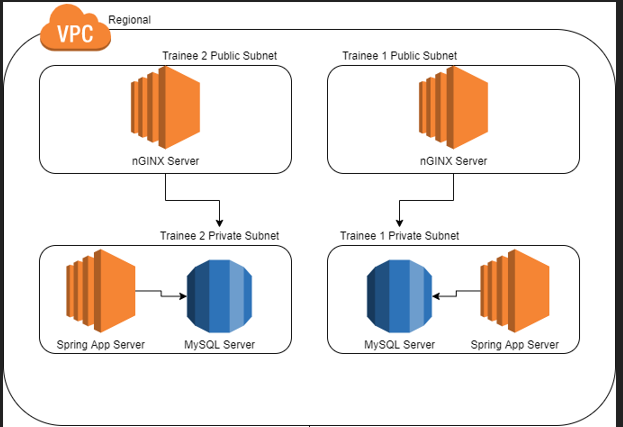

# AWS Fundamentals Homework




A brief example of the homework's deployment can be seen above.

**Important pointers in regards to the homework**:
- make sure you have all the configuration in CloudFormation and UserData; the aim is to have something that can be created in one go (you don't need to add everything in UserData from the beginning, just make sure that you have all the commands there when you present the homework). You can also use the console to create resources during your testing, but make sure to have everything in CFN at the end.
- do not delete resources that are not yours (either the shared ones or from another trainee)
- assign a Name tag to all the resources that can take *Tags*. The name needs to be suggestive - at the very least, you should use ```yourName-resource``` (example: tdominte-app-instance)
- use the specified resource types and constraints, do not go higher than that without asking the trainer first
- use the documentation (you have links for some CFN resources there)
- make sure to delete **all your resources** after you are finished with your homework!


Tasks:
1. In the VPC that corresponds to your country, **create two subnets**: one public and one private. These subnets will *need* to have a /28 subnet mask over their CIDR range. Be sure to look at the other subnets in the VPC in order to choose an appropriate CIDR. These subnets will be **tied to the shared country Internet Gateway and NAT Gateway** - do not create additional gateways.
2. Create two EC2 instances - both **t3.micro** - one private, one public (use a Ubuntu 18.04 LTS AMI, amd64, hvm:ebs-ssd for your region from [here](https://cloud-images.ubuntu.com/locator/ec2/)). Allocate 8 GB of gp2 storage for these instances.
3. Configure SSH on the created instances. You should use a KeyPair for this purpose. The public instance will be sort of a 'bastion' server for the private subnet, as you will not be able to access the private instances directly.
4. Install nginx on the public instance and clone https://github.com/spring-projects/spring-petclinic + install all its requirements on the private instance. In the provided UserData, configure the two applications (nginx and Spring Petclinic) so that they're both ready on instance creation. The nginx configuration will need to point to the Spring Petclinic app server using a route (can be the default one, or one configured by you). Start the application without a profile, so that it uses the in-memory database. *Verify that the application can be accessed from the browser.*
5. (Optional) Create another t3.micro instance in the private subnet, and install either mySQL or PostgreSQL on it. Configure the application to connect to this database (using the profiles and variables mentioned in the GitHub readme). Test that your data persists by doing some flows via the UI, restarting the Spring app, and seeing that the data you've entered is still there.