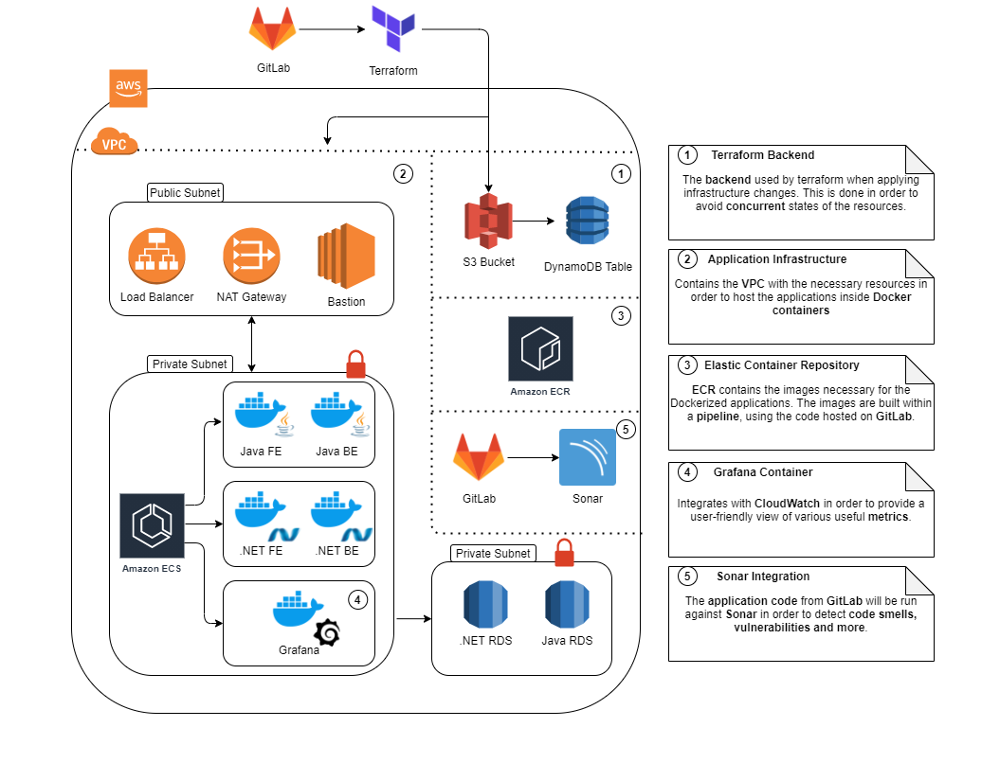

# Sample Infrastructure

## ECS Infrastructure

Here, you can find a sample infrastructure that uses ECS and ECR to bring up application, also being created with IaC via terraform, from a GitLab repository. The infrastructure will be used to host two back-end applications, one written in Java, one written in .NET, and two front-end applications (written in AngularJS).

The infra hosts one public subnet and two private ones. The public subnet will use a load balancer to forward traffic to the application private subnet. We will also need a NAT gateway (so that the ECS agent is able to send a reply to the internet), and a bastion instance, used to connect to instances in the private subnets. The second private subnet will host two RDS instances, one for each application (the Java one will be postgres, the .NET one will be mysql).

In the application private subnet, an ECS agent will be running, and it will create two Java containers (one for the front-end, one for the back-end). The FE will include an nginx installation in order to display the built artefacts. A similar approach will be used for a the .NET applications, having two containers as well. There is an additional Grafana container, which will display several CloudWatch metrics. ECR will be used to host the images needed for the applications.

The terraform .tfstate will be persisted in an S3 Bucket with versioning enabled, and each update on the .tfstate will send the file to a DynamoDB table.

The GitLab repo will also be connected to a Sonar application, in order to run various checks on the code.

General code pipeline: the infrastructure code gets pushed to GitLab, it triggers the terraform apply, which will create / update the infrastructure, also persisting the .tfstate to the S3 bucket and DynamoDB table.
General application pipeline: the user will send a request to the load balancer (or domain name, if Route53 is configured), which will then be forwarded to the task running the requested resource - this is done via target groups on the load balancer (having different target groups for Java FE, Java BE, .NET FE, .NET BE). The response is then fed back to the client. The bastion instance can be used by AM / DevOps engineers in order to troubleshoot varied issues on the instances (for example, connecting to the ECS agent and checking the logs from the BE applications).

To improve on this, one could also create a Kibana container, that could easily be used to troubleshoot logs without going through the bastion instance. The bastion instance is there only to forward access towards the private instances (which, of course, cannot be accessed from the outside).

The ECS agent will also need to have a security group with proper mappings for the BE containers of both applications, as well as for the Grafana container.