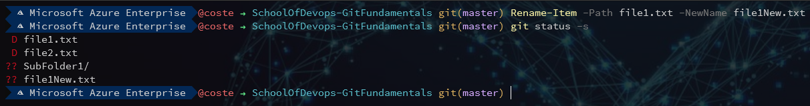
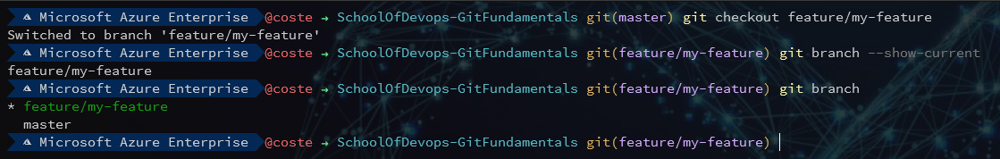

# Basic Commands Usage

Open a new PowerShell (no need for elevation/admin)

## Check if Git is working properly

- Run `git version`. This should prompt you with your currently installed git version.
- Ask the man! Remember that git has its own help command which can prove useful:  
  - `git -h` for a short version
  - `git --help` for the longer version

## Initialize a new repository

- To begin with, you will initialize your first repository in the previously created folder:  
`Set-Location -Path C:\Projects\SoD-GitFundamentals`  
`git init`  
The outcome should look similar to:  


## Create a new file and commit it to the local repo

- Create a new file with some content:  
`Write-Output "Hi" | Out-File -FilePath ./file1.txt`

- Check the status of the working directory:  
`git status`  


We can see that git acknowledged the existence of a new file and it lets us know that it is not being tracked currently.

- Add the file to the staging area:  
`git add file1.txt`  
When checking the status again we can see that git has now moved **file1.txt** to the staging area and is not tracking it:  


- Commit the changes, providing a meaningful description:  
`git commit -m "Initial Commit"`  
We get a confirmation that the changes have been commited. Checking the status will let us know that there are no new changes:  
  
We expected to see this since we've just updated the local repository with our changes so it matches our working directory.

## Work with the staging area

In some cases we might have added some files in the staging area, but we want to add additional changes to these files.  

- Add a new file:  
`Write-Output "Spome tecxt" | Out-File -FilePath ./file2.txt`  
`git add file2.txt`  
The file is ready to be commited:  

- Correct the typo in our file:  
`Write-Output "Some text" | Out-File -FilePath ./file2.txt`  
If we check the status again:  
  
We see that Git is aware of both the change that we've staged previously (with the typo), as well as the current change (correct one).
We can also check the status with `git status -s`, which will show a more concise version:  
  
This shows two columns for each file. The first column shows what's going on in the staging area (new file [A]dded in our case), while the second shows the working directory (untracked [M]odified changes).  

- At this point we add a third file. We should see a ?? on the two columns as the new file is not tracked yet:  
`Write-Output "Newly added file" | Out-File -FilePath ./file3.txt`  
  
If we add both our files to the staging area:  
`git add .`  


- Check what lines of code we have modified in our staged files:  
`git diff --staged`  
  
Generally we use Visual-Based Diff tools to check the differences as it is easier. Visual Studio Code supports this.  
To check differences between working directory and the staging area use `git diff`.  
In order to use the Visual-Based Diff Tool configured initially, we should use `git difftool` instead of `git diff`.

- At this point we can do another commit with our latest changes:
`git commit`
If we don't add the `-m "Message"` parameter, Git will open our Editor for us to set a message instead:  
  
After we set our message, we can safely close the window and the commit will be done.

## Remove a file

- We decide we don't need file3.txt anymore, so we want to delete it:  
`Remove-Item -Path file3.txt`  
  
We now have a new change in our working directory, representing the [D]eletion of **file3.txt**.  

- In order for us to also delete this from the repository, we would need to stage and commit these changes. We can do this all in one go using the following command:  
`git commit -am "Removed unnecessary file"`  
  
The `-a` option will automatically track all changed files.

## Rename or move a file

- Moving and renaming files are quite similar scenarios. Both of them imply a removal or the old file and addition of the new one. For example if we move file2.txt to a new folder, we would see the following status:  
`New-Item -Type Directory -Name SubFolder1`  
`Move-Item file2.txt -Destination SubFolder1\`  


- Renaming file1.txt would produce a simlar result:  


- If we commit these changes, we would see the new structure in the repo:  
`git commit -am "Moved and renamed files"`  


## Branches

- You can check what is your current working branch with `git branch --show-current`. To see all branches use `git branch`
- To create a new branch you can use `git branch <branchName>`  
  
- By using `git checkout -b feature/my-feature` instead, in addition to creating the branch, it will also move your working directory on it:  


When working with multiple contributors, we tend to create folders for our branches, like we've seen the **features/** branch folder above. The folder used depends on the purpose of the branch.  

We will simulate working on a new feature for our project. We will do all our work on this **feature/** branch then we will merge it back to **master**.

- Add some files and make changes to existing ones:  
```Write-Output "JavaScript Code" | Out-File -FilePath ./script.js && Write-Output "Style Code" | Out-File -FilePath ./style.css && Write-Output "Appended Code" | Out-File -FilePath ./file1New.txt -Append```

- Add and commit the changes: `git add . && git commit -m "Create feature UI"`

- To merge these changes into master we first need to swap to the master branch, then run the merge command:
`git checkout master && git merge feature/my-feature`  


## Git GUI-Based tools

- Visual Studio Code GitLens Extension: Free
- SourceTree: Free
- GitKraken: Paid for commercial use

## Cloning existing repositories

So far we have only worked with local repositories. It is possible to clone remote repositories using the clone command:  
`git clone <URL to Repo>`
