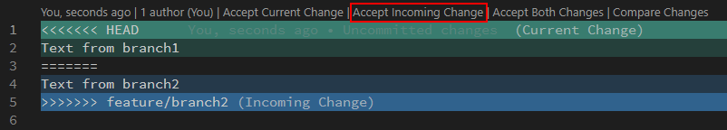

# Advanced Commands Usage

Open a new PowerShell (no need for elevation/admin)

## Check if Git is working properly

- Run `git version`. This should prompt you with your currently installed git version.
- Ask the man! Remember that git has its own help command which can prove useful:  
  - `git -h` for a short version
  - `git --help` for the longer version

## Git Merge

As we've seen previously, `git merge <branch>` is the most basic type of merge. By default it will create a new commit that will have two parents, one is the latest commit on the destination (current) branch, and the second being the latest commit on the source branch.

The usage for this was presented in the previous exercise.

## Git Merge Squash

By using `git merge --squash <branch>` we can create a new commit on the destination branch, containing all the modifications that have been done to the source branch.

Pro:

- We get a clean history for the destination branch

Con:

- We lose the details provided by conserving the source branch history

### Example Squash

- Make sure you're on the master branch: `git checkout master`  
- Create and move to a new branch: `git checkout -b feature/merge-example`  
- Create two new commits:
  - `Write-Output "Commit 1" | Out-File -FilePath ./Squash1.txt && git add . && git commit -m "First commit"`
  - `Write-Output "Commit 2" | Out-File -FilePath ./Squash2.txt && git add . && git commit -m "Second commit"`
- Move back on the master branch: `git checkout master`
- Squash the commits from the source branch: `git merge --squash feature/merge-example`
- Provide a commit name for the destination squashed commit: `git commit -m "Squashed commits 1 and 2"`
- Check the restults with: `git log`

## Git Rebase

Git rebase will help you update the commit on which your branch is based, essentially integrating changed from the source branch into yours.  
It is generally advised to do this frequently in order to not miss on potentially conflicting changes between your branch and the main branch.

### Example Rebase

- Make sure you're on the master branch: `git checkout master`  
- Create a new commit: `Write-Output "Commit 1" | Out-File -FilePath ./Rebase1.txt && git add . && git commit -m "Additional commit"`
- Move back to your *feature/merge-example* branch: `git checkout feature/merge-example`
- Check the difference between the *master* and the *feature/merge-example* branches: `git log master..feature/merge-example`
- You can see that the *master* branch is ahead by two commits
- Integrate these commits into your branch by using `git rebase master`
- Check the difference between branches again: `git log master..feature/merge-example`

## Git Rebase and Fast Forward Merge

One thing that happens often is that people will merge the integration branch (master in our case) back into their branch to grab the latest changes. This will create a new commit representing the merge of the two branches. Then they will merge the feature branch into the integration branch, essentially duplicating some commits on the master branch.  

A very good use of Rebase is together with a FF Merge. This will ensure a clean history with no duplicate commits.  
So instead of merging the integration branch into ours, we instead use a Rebase to integrate other people's changes into our branch.  
Then we can safely Fast Forward Merge our changes onto the integration branch. This will replay our commits onto the destination branch, essentially making it look like we worked directly on the *master* branch and providing a clean history.

### Example Rebase and FF Merge

- Make sure you're on the master branch: `git checkout master`  
- Create a new commit: `Write-Output "Commit 1" | Out-File -FilePath ./RebaseFF1.txt && git add . && git commit -m "Another commit on master branch"`
- Move back to your *feature/merge-example* branch: `git checkout feature/merge-example`
- Create a new commit: `Write-Output "Commit 2" | Out-File -FilePath ./RebaseFF2.txt && git add . && git commit -m "Another commit on feature branch"`
- Integrate the commits from *master* into your branch by using `git rebase master`
- Move back to *master*: `git checkout master`  
- Replay your commits on the master branch with: `git merge --ff-only feature/merge-example`
- Check the history now with `git log`

## Git Cherry Pick

Git Cherry Pick is a command designed to help replaying changes from a specific commit to a different branch (or a different point in time).
You should generally avoid using this as there is a risk of causing duplicate commits, but it's useful to know about it as it can help saving time.  
One use case is when you have commited some changes on the wrong branch. At that point you could use `git log` to get the commit SHA, then move to correct branch and use `git cherry-pick <commitSHA>` to replay the commit on that branch.  
If you wish to replay multiple commits, you can use the two commits SHA that delimit the inteval.

### Example Cherry Pick

- Make sure you're on the master branch: `git checkout master`  
- Create a new branch called *feature/branch1*: `git checkout -b feature/branch1`  
- Move back to *master* and create another branch called *feature/branch2*:
  - `git checkout master`
  - `git checkout -b feature/branch2`
- Create three empty commits on *feature/branch2*:
  - `Write-Output "Commit 1" | Out-File -FilePath ./Cherry1.txt && git add . && git commit -m "First commit"`
  - `Write-Output "Commit 2" | Out-File -FilePath ./Cherry2.txt && git add . && git commit -m "Second commit"`
  - `Write-Output "Commit 3" | Out-File -FilePath ./Cherry3.txt && git add . && git commit -m "Third commit"`
- Use `git log` to grab the latest commit SHA from the current branch.
- Move to *feature/branch1*: `git checkout feature/branch1`  
- Replay the three commits on the current branch: `git cherry-pick <SHA of commit 1's parent>..<SHA of commit 3>`
- Check the new history of the branch: `git log`

## Resolving Git Conflicts

A conflict appears when a section of a file is modified in multiple branches.  
Let's use the previous branches to show how a conflict would be generated and how to approach resolving it.  

- Make sure you're on *feature/branch1*: `git checkout feature/branch1`
- Create a new file with some text: `Write-Output "Text from branch1" | Out-File -FilePath ./conflict.txt`
- Commit this file:
  - `git add .`
  - `git commit -m "Add conflict file on branch1"`
- Move to the master branch: `git checkout master`
- Integrate the changes from *feature/branch1*: `git merge --ff-only feature/branch1`
- Move on *feature/branch2*: `git checkout feature/branch2`
- Create the same file with different contents: `Write-Output "Text from branch2" | Out-File -FilePath ./conflict.txt`
- Commit this file:
  - `git add .`
  - `git commit -m "Add conflict file on branch2"`  
- Move to the master branch: `git checkout master`
- Try to integrate the changes from *feature/branch2*: `git merge feature/branch2`

We get an error telling us that we are currently in a conflict state.  
To solve this we will need to manually modify the *conflict.txt* file.
If using VSCode, you could simply press one of the buttons (Accept current changes/Accept incomming changes) and that will take care of deleting the extra generated text. Else, you would need to set the file contents to the final state that you would like.  

- After solving that conflict, you would need to create a new commit for this merge:
  - `git add .`
  - `git commit -m "Resolved merge conflicts"`
- Check the current status of the branch with: `git log`
