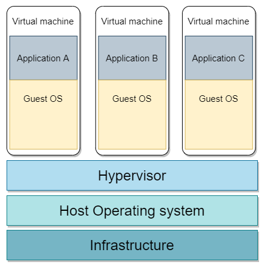
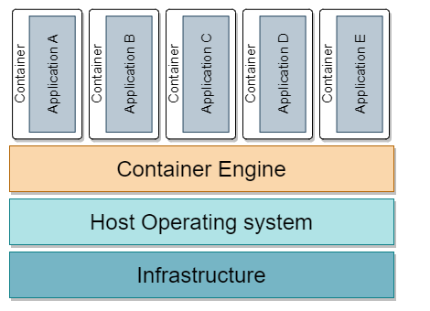

# Introduction to Containers

[TOC]

## Virtualization

Definition: **virtualization** or **virtualisation** is the act of creating a virtual version of computer hardware, storage devices and computer network resources ~ [wikipedia](https://en.wikipedia.org/wiki/Virtualization)

### Hypervisors

By using software called hypervisors, the physical resources are separated from virtual environments.

A hypervisor, also known as a virtual machine monitor or VMM, is software that creates and runs virtual machines (VMs).A hypervisor allows one host computer to support multiple guest VMs by virtually sharing its resources, such as memory and processing.

Hypervisors are of 2 types:

- **Native Hypervisor:** This type is also called a Bare-metal Hypervisor and runs directly on the underlying host system which also ensures direct access to the host hardware which is why it does not require base OS. Examples of Native Hypervisors: *VMware's ESXi*, *KVM* (Kernel-based Virtual Machine), and Microsoft's *Hyper-V*
- **Hosted Hypervisor:** This type makes use of the underlying host operating system which has the existing OS installed. Examples of Hosted Hypervisors: Oracle's *VirtualBox* and VMware's *VMware Player*



### Types of virtualization

#### Hardware virtualization

**Hardware virtualization** refers to the creation of a virtual machine that acts like a real computer with an operating system. To the applications running on the virtualized machine, it appears as if they are running on their own dedicated machine.

##### Benefits of Virtual Machines

- **More efficient use of hardware**: Being able to create virtual servers allow you to run multiple operation systems on the same hardware. This leads to efficiency in everything from maintenance to energy costs.
- **Easier and faster management and provisioning**: It is much easier to spin up a virtual server than provision new hardware and it is easier to create backups and snapshots.
- **Improved disaster recovery**: Is is also easier and faster to restore the system to a previous state by restoring from an existing snapshot.
- **Simplified testing**: Using VM's, you can run a logical isolated system and test your applications without any change to your OS ( or production environment ).

#### Containerisation

**Containerisation** is the packaging of software code with just the operating system libraries and dependencies required to run the code to create a single lightweight executable that runs consistently on any infrastructure.

[Containers](#containers) run on top of a container engine which runs on top of a host operating system. The host operating system can be bare metal or a VM. This configuration gives the ability to run multiple logically isolated applications efficiently.

#### Memory

- **Memory virtualization**: aggregating RAM from network resources into a single memory pool
- **Virtual memory**: giving an app the impression that it has continuous address space, isolating it from the physical memory.

#### Storage

- **Storage virtualization**
- **Distributed file system**
- **Virtual file system**
- **Virtual disk**

#### Network

- **Network virtualization**
- **Virtual private network**

### Exercises

- create a virtual machine and install Ubuntu
- create 2 virtual machines and a virtual network. Configure the 2 VM's in such a way that they can communicate with each other (ex. ssh from one machine to another)

### Sources

- <https://www.redhat.com/en/topics/virtualization>
- <https://opensource.com/resources/virtualization>
- <https://www.redhat.com/en/topics/virtualization/what-is-a-hypervisor>
- <https://en.wikipedia.org/wiki/Hyper-V>

## Containers

### What are containers?

A container is a package of software code with just the operating system libraries and dependencies required to run the code.



### Why containers?

The container is roughly analogue to a VM with the major difference that the container does not require a full OS.

In fact, all containers on a single host share that host's OS which reduces the usage of resources like CPU, RAM and storage.

Containers are also fast to start and they run the same on any infrastructure (ex. bare metal, cloud, virtual machines).

### Windows containers vs Linux Containers

A running container shares the kernel of the host machine on which it is running which means that a a Windows application container will run only on Windows hosts and Linux containers will run only on Linux hosts.

Although you can run use Docker desktop to run Windows and Linux containers, the Linux container will actually run on a Linux OS (WSL or Virtual machine).

## Docker

Docker is one of the main platforms for building, running and orchestrate containers.

### Docker components

#### Docker runtime

The runtime operates at the lowest level and is responsible for starting and stopping containers (this includes building all the OS constructs such as namespaces and cgroups).

The low-level runtime is called *runc* and it's job is to interface with the underlying OS and start / stop containers.

The higher-level runtime is called *containerd* and manages the entire lifecycle of a container , including pulling images, creating network interfaces and managing lower-level runc instances

#### Docker daemon

The docker daemon (*dockerd*) sits above *containerd* and performs higher-level tasks such as: exposing the Docker remote api and managing images, networks and volumes.

#### Docker orchestrator

Docker has native support for managing cluster of nodes running Docker. This technology is called *Docker Swarm*.

### Install Docker

Resources:

- <https://docs.docker.com/engine/install/debian/>
- <https://docs.docker.com/engine/install/rhel/>
- <https://docs.docker.com/engine/install/ubuntu/>
- <https://docs.docker.com/desktop/windows/install/>
- [Install docker compose v2](https://docs.docker.com/compose/cli-command/)

#### Install Docker on Debian

Add GPG key

```shell
curl -fsSL https://download.docker.com/linux/debian/gpg | sudo apt-key add -
```

Add repository (replace arch=amd64 with arch=arm64 for ARM 64 bit architecture)

```shell
echo "deb [arch=amd64] https://download.docker.com/linux/debian $(lsb_release -cs) stable" | sudo tee /etc/apt/sources.list.d/docker.list
```

Install docker-ce and containerd

```shell
sudo apt update
sudo apt install -y docker-ce docker-ce-cli containerd.io
```

Install docker compose v2

```shell
mkdir -p ~/.docker/cli-plugins/
curl -SL https://github.com/docker/compose/releases/download/v2.2.2/docker-compose-linux-x86_64 -o ~/.docker/cli-plugins/docker-compose
chmod +x ~/.docker/cli-plugins/docker-compose
```

#### Install Docker on Ubuntu

Add GPG key

```shell
curl -fsSL https://download.docker.com/linux/ubuntu/gpg | sudo apt-key add -
```

Add repository (replace arch=amd64 with arch=arm64 for ARM 64 bit architecture)

```shell
echo "deb [arch=amd64] https://download.docker.com/linux/ubuntu $(lsb_release -cs) stable" | sudo tee /etc/apt/sources.list.d/docker.list
```

Install docker-ce and containerd

```shell
sudo apt update
sudo apt install -y docker-ce docker-ce-cli containerd.io
```

Install docker compose v2

```shell
mkdir -p ~/.docker/cli-plugins/
curl -SL https://github.com/docker/compose/releases/download/v2.2.2/docker-compose-linux-x86_64 -o ~/.docker/cli-plugins/docker-compose
chmod +x ~/.docker/cli-plugins/docker-compose
```

#### Test installation

```shell
docker version
docker compose version
```

### Docker image

You can think of a Docker image as an object that contains an OS filesystem, an application and all application dependencies. 

Run `docker image ls` and check the output. 

```shell
> docker image ls
REPOSITORY                     TAG            IMAGE ID       CREATED         SIZE
```

If this is a fresly installed docker you will not see any image in the output.

Run `docker pull ubuntu:20.04`. After the command finishes with success, run `docker image ls` again and check the output.

```shell
> docker pull ubuntu:20.04
20.04: Pulling from library/ubuntu
7b1a6ab2e44d: Pull complete 
Digest: sha256:626ffe58f6e7566e00254b638eb7e0f3b11d4da9675088f4781a50ae288f3322
Status: Downloaded newer image for ubuntu:20.04
docker.io/library/ubuntu:20.04
> > docker image ls
REPOSITORY   TAG       IMAGE ID       CREATED        SIZE
ubuntu       20.04     ba6acccedd29   2 months ago   72.8MB
```

### Docker containers

Now that we have an image pulled locally, we can launch a container from it.

```shell
> docker run -it --rm ubuntu:20.04 bash
root@9357b3046370:/# ps
```

At this point, you can see that the shell prompt has changed and we are literally inside the new container.

What we did was to tell docker to `run` the image, switch the shell to the container terminal (the `-it` flag), remove the container after we exit the terminal (the `--rm`flag) and start the bash shell.

Run a `ps` command inside the container to list all running processes.

```shell
root@9357b3046370:/# ps -elf
F S UID          PID    PPID  C PRI  NI ADDR SZ WCHAN  STIME TTY          TIME CMD
4 S root           1       0  0  80   0 -  1029 do_wai 10:22 pts/0    00:00:00 bash
0 R root          11       1  0  80   0 -  1476 -      10:30 pts/0    00:00:00 ps -elf
root@9357b3046370:/# 
```

To exit a container without sopping it press `CTRL-PQ`.

#### Connect to a running container

Now open a new terminal window ( or press `CTRL-PQ` in order to exit without stopping the current running container) and run `docker container ls` (or `docker ps`).

```shell
> docker container ls
CONTAINER ID   IMAGE          COMMAND   CREATED          STATUS          PORTS     NAMES
9357b3046370   ubuntu:20.04   "bash"    19 minutes ago   Up 19 minutes             happy_shannon
```

In order to connect to a running container we can use either the container id or the container name.

Run the command `docker exec -it 9357b3046370 bash` ( replace with your container id/name)

```shell
> docker exec -it 9357b3046370 bash
root@9357b3046370:/#
```

#### Stop a running container

To stop a running container use `docker container stop` with container id or name. 

```shell
> docker container stop happy_shannon
happy_shannon
```

If the container does not stop, we can force stop it by using `kill` instead of `stop`.

After the container stops - if it was not started with the  `--rm` flag -  we remove it with `docker container rm`.

```she
> docker container rm happy_shannon
```

To verify that the container was deleted, run the `docker container ls` command with the `-a` flag.

```she
> docker container ls -a
CONTAINER ID   IMAGE     COMMAND   CREATED   STATUS    PORTS     NAMES
```

### Create a Docker image

#### Create a Dockerfile

In order to build a custom docker image we need to create a file called [Dockerfile](https://docs.docker.com/engine/reference/builder/).

```she
mkdir my-docker-image
cd my-docker-image
echo "Hello" > README.md
touch Dockerfile
```

Edit the Dockerfile file and add the following content

```dockerfile
FROM alpine

RUN apk add --update python3
RUN mkdir -p /app

COPY . /app

WORKDIR /app

CMD [ "cat", "README.md" ]
```

#### Using the .dockerignore

When buliding a docker image, the entire content of the source folder is sent to the Docker daemon. In most cases there are more files in that folder that we do not need for the build process.

In order to avoid overloading the Docker daemon with data we do not need, we create in the source folder a file called [.dockerignore](https://docs.docker.com/engine/reference/builder/#dockerignore-file) .

The `.dockerignore` file is similar to `.gitignore` file used by  the git tool. Similarly to `.gitignore` file, it allows us to specify a pattern for files and folders that should be ignored by the Docker client when generating a build context.

Example configuration: 

```.dockerignore
# ignore .git and .cache folders
.git
.cache
# ignore all markdown files (md) except README.md
*.md
!README.md
```

#### Build Docker image

##### Build the image

```shell
> docker build -t my-docker-image .
Sending build context to Docker daemon  15.87kB
Step 1/6 : FROM alpine
latest: Pulling from library/alpine
59bf1c3509f3: Pull complete
Digest: sha256:21a3deaa0d32a8057914f36584b5288d2e5ecc984380bc0118285c70fa8c9300
Status: Downloaded newer image for alpine:latest
 ---> c059bfaa849c
Step 2/6 : RUN apk add --update python3
 ---> Running in 310a3b136a58
fetch https://dl-cdn.alpinelinux.org/alpine/v3.15/main/x86_64/APKINDEX.tar.gz
fetch https://dl-cdn.alpinelinux.org/alpine/v3.15/community/x86_64/APKINDEX.tar.gz
(1/13) Installing libbz2 (1.0.8-r1)
(2/13) Installing expat (2.4.1-r0)
(3/13) Installing libffi (3.4.2-r1)
(4/13) Installing gdbm (1.22-r0)
(5/13) Installing xz-libs (5.2.5-r0)
(6/13) Installing libgcc (10.3.1_git20211027-r0)
(7/13) Installing libstdc++ (10.3.1_git20211027-r0)
(8/13) Installing mpdecimal (2.5.1-r1)
(9/13) Installing ncurses-terminfo-base (6.3_p20211120-r0)
(10/13) Installing ncurses-libs (6.3_p20211120-r0)
(11/13) Installing readline (8.1.1-r0)
(12/13) Installing sqlite-libs (3.36.0-r0)
(13/13) Installing python3 (3.9.7-r4)
Executing busybox-1.34.1-r3.trigger
OK: 56 MiB in 27 packages
Removing intermediate container 310a3b136a58
 ---> 66878a1d2fa9
Step 3/6 : RUN mkdir -p /app
 ---> Running in dee1d6d14bed
Removing intermediate container dee1d6d14bed
 ---> 90bf4c76fc96
Step 4/6 : COPY . /app
 ---> 8b9c30993055
Step 5/6 : WORKDIR /app
 ---> Running in a43300ae9b0f
Removing intermediate container a43300ae9b0f
 ---> d39574dcf977
Step 6/6 : CMD [ "cat", "README.md" ]
 ---> Running in d46833f90568
Removing intermediate container d46833f90568
 ---> ea7a25ee0e9c
Successfully built ea7a25ee0e9c
Successfully tagged my-docker-image:latest
```

##### Check the image exists on your host

```shell
> docker image ls
REPOSITORY        TAG       IMAGE ID       CREATED         SIZE
my-docker-image   latest    ea7a25ee0e9c   2 minutes ago   54MB
alpine            latest    c059bfaa849c   3 weeks ago     5.59MB
```

##### Run a container from the image

```shell
docker container run --rm my-docker-image
```

##### Run container and overwrite the specified CMD

```shell
> docker container run --rm -it my-docker-image python3
Python 3.9.7 (default, Nov 24 2021, 21:15:59)
[GCC 10.3.1 20211027] on linux
Type "help", "copyright", "credits" or "license" for more information.
>>>
```

#### Exercises

1. Edit the Dockerfile, install `bash` and rebuild the docker image.
2. Start the Docker image with a local folder mounted in the container (ex. `docker run --rm -it -v $PWD:/workspace my-docker-image bash`) 
3. In the container, go to the mounted folder and create a file.
4. Check that the file exists in container and also on the host file system

### Dockerfile instructions

Most used instructions:

| Name       | Description |
| ---------- | ----------------- |
| [FROM](https://docs.docker.com/engine/reference/builder/#from) | Sets the base image for the subsequent instructions. |
| [RUN](https://docs.docker.com/engine/reference/builder/#run) | Execute any commands in a new layer on top of the current image and commit the results. The resulting committed image will be used for the next step in the `Dockerfile`. |
| [CMD](https://docs.docker.com/engine/reference/builder/#cmd) | Provides default command and/or parameters, which can be overwritten from command line when the container runs. |
| [ENTRYPOINT](https://docs.docker.com/engine/reference/builder/#entrypoint) | Configures a container to be run as an executable. |
| [LABEL](https://docs.docker.com/engine/reference/builder/#label) | Adds metadata to an image. |
| [ENV](https://docs.docker.com/engine/reference/builder/#env) | Sets environment variables that will be available when running the container. |
| [ADD](https://docs.docker.com/engine/reference/builder/#add) | Copies new files, directories or remote file URLs to the filesystem of the image. |
| [COPY](https://docs.docker.com/engine/reference/builder/#copy) | Copies new files or directories to the filesystem of the image. |
| [EXPOSE](https://docs.docker.com/engine/reference/builder/#expose) | Informs Docker that the container listens on the specified network ports at runtime. |
| [VOLUME](https://docs.docker.com/engine/reference/builder/#volume) | Creates a mount point and marks it as holding externally mounted volumes from native host or other containers. |
| [USER](https://docs.docker.com/engine/reference/builder/#user) | Sets the user name (or UID) and optionally the user group (or GID) to use when running the image and for any `RUN`, `CMD` and `ENTRYPOINT` instructions that follow it in the `Dockerfile`. |
| [WORKDIR](https://docs.docker.com/engine/reference/builder/#workdir) | Sets the working directory for any `RUN`, `CMD`, `ENTRYPOINT`, `COPY` and `ADD` instructions that follow it in the `Dockerfile`. |
| [ARG](https://docs.docker.com/engine/reference/builder/#arg) | Defines a variable that users can pass at build-time to the builder with the `docker build` command using the `--build-arg <varname>=<value>` flag. |

### Shell and Exec forms

All three instructions (`RUN`, `CMD`, `ENTRYPOINT`) can be specified in *shell* or *exec* form.

#### Shell form

```shell
<instruction> <command>
```

Examples:

```dockerfile
RUN apk add --update python3
CMD echo "Hello"
ENTRYPOINT echo "Hello"
```

When instruction is executed in *shell* form, it calls `/bin/sh -c <command>` and normal shell processing happens. For example, the following snippet in `Dockerfile` 

```dockerfile
ENV NAME Jane
ENTRYPOINT echo "Hello, $NAME"
```

will output 

```text
Hello, Jane
```

#### Exec form

```shell
<instruction> [ "executable", "param1", "param2", ... ]
```

Examples:

```dockerfile
RUN [ "apk", "add", "--update", "python3" ]
CMD [ "/bin/echo", "Hello" ]
ENTRYPOINT [ "/bin/echo", "Hello" ]
```

When instruction is executed in *exec* form it calls the executable directly and shell processing does not happen. For example, the following snippet in `Dockerfile`

```dockerfile
ENV NAME Jane
ENTRYPOINT [ "/bin/echo", "Hello, $NAME" ]
```

will output

```text
Hello, $NAME
```

Note that the variable *NAME* is not substituted.

#### Exercises

1. Read about CMD vs ENTRYPOINT
2. Run a container with ENTRYPOINT specified in *shell*.
3. Run a container with ENTRYPOINT specified in *exec*.
4. Check process PID in both containers (ex. using `ps`).
4. Note that in *exec* form, your command has PID 1. This is good to know especially when stopping a container - docker attempts to [stop a running container](https://docs.docker.com/engine/reference/commandline/stop/) first by sending a SIGTERM signal to the root process in the container.

### Storing docker images

#### Image registries

Docker images are stored in centralised places called *image registries* which makes it easy to share and access them form different environments.

There are various public and private registries, most used public registry being the Docker Hub (<https://hub.docker.com>). Docker Hub is also the default registry that the docker client is using for searching and pushing images.

Image registries contain one or more *image repositories* which in turn, contain one or more images.

Docker Hub has the concept of *official repositories* and *unofficial repositories*.

The *official repositories* contain images that have been vetted and curated by Docker - which means they should contain images that are secure and in-line with best practices.

The *unofficial repositories* contain user or organisation repositories that may or may not be safe to use.

As a rule, you should always be careful when trusting software form the Internet - even images from *official repositories*.

#### Image naming 

When referencing images from *official repositories*, we only need to specify the repository name and the image tag separated by colon ( : ). The format for `docker image pull` when working with an official repository is:

```shell
docker image pull <repository>:<tag>
```

For example, to retrieve the latest Alpine image we use 

```shell
docker image pull alpine:latest
```

When referencing imaged from *unofficial repositories* we need to prepend the repository name with a Docker Hub user name or organisation name

```shell
docker image pull <user/organisation>/<repository>:<tag>
```

**Note:**

- If you do not specify the image tag, Docker will assume you are referring to the image tagged as *latest*.
- If and imaged is tagged as *latest* does not guarantee it is the most recent image in the repository

#### Exercises

1. Create an account on Docker Hub
2. Push an image to Docker Hub

### Homework

#### Build a docker image with simple web application

Create a docker image that runs an http server and publish the image to Docker Hub.

Example setup:

- create a docker image based on alpine
- install Nginx
- copy web files in the docker image (ex. an index.html file)
- push image to Docker Hub

#### Build a docker image with a Markdown powered wiki

Requirements:

- the image should contain an http server (ex. nginx, nodejs http server, etc.)
- markdown files should be copied into the image during the build process
- when the container is accessed over http and port 8080 it should 
  - render the markdown files (view in html format)
  - you should be able to navigate between makrdown files
