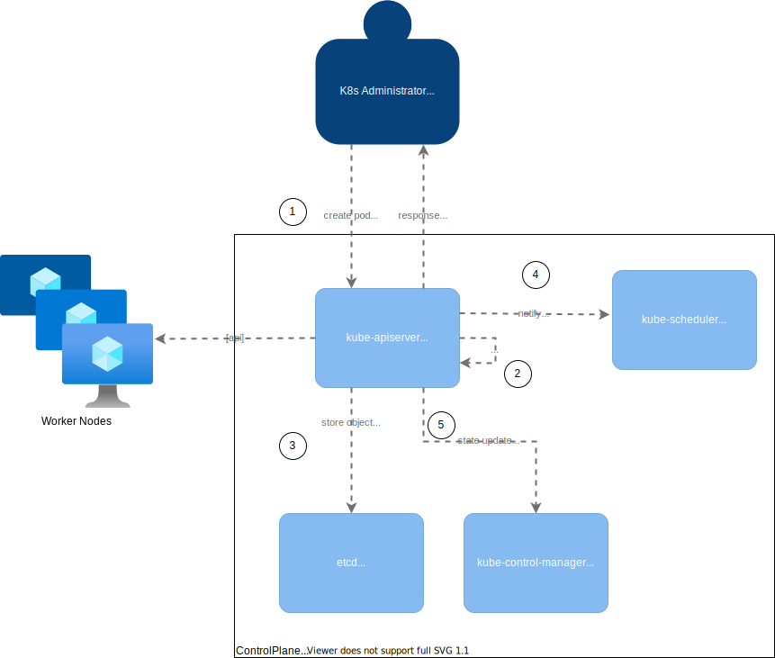

# Introduction to Kubernetes

This document provides a generic overview over what Kubernets is. Areas that will be covered:
- orchestration
- containerization
- API

Purpose of this repo is to provide an overview about what and why people use K8s. In addition some of the basic resources are explained.
- [Introduction to Kubernetes](#introduction-to-kubernetes)
- [General Overview](#general-overview)
- [Arhitecture](#arhitecture)
  - [Manifests](#manifests)
  - [Cluster Components](#cluster-components)
    - [Control Plane](#control-plane)
    - [Nodes](#nodes)
  - [Labels, selectors & annotations](#labels-selectors--annotations)
- [Installation](#installation)
  - [Kubernetes](#kubernetes)
  - [Kubectl](#kubectl)
  - [Kubeconfig](#kubeconfig)
- [Namespace](#namespace)
- [Authorization (RBAC)](#authorization-rbac)
  - [(Cluster)Roles](#clusterroles)
  - [ServiceAccounts](#serviceaccounts)
  - [(Cluster)RoleBindings](#clusterrolebindings)
- [Workloads](#workloads)
  - [Pod](#pod)
  - [ReplicaSet](#replicaset)
  - [StatefulSet](#statefulset)
  - [DaemonSet](#daemonset)
  - [Deployment](#deployment)
  - [(Cron)Jobs](#cronjobs)
- [Network](#network)
  - [Service](#service)
  - [NetworkPolicies](#networkpolicies)
- [Configuration](#configuration)
  - [Secret](#secret)
  - [ConfigMap](#configmap)
- [Storage](#storage)
  - [PersistentVolume](#persistentvolume)
  - [emptyDir](#emptydir)
- [CRD](#crd)
- [Advanced](#advanced)
  - [Helm](#helm)
  - [Tools (k9s, lens)](#tools-k9s-lens)
  - [Alternatives](#alternatives)

# General Overview

Containerization is a mechanism that allows isolation of code and it's dependency in an "unit" called container. 

Containers are great for single purpose services. But in practice these containers need to be configurable, highly available (scaled), secure, to communicate with other services (microservice pattern), monitored and much more.

Configuration -> changing properties (system properties, runtime properties, volume attachment) in order to determine a specific behavior for the container

Configuration example includes:
- attach volumes to containers for e.g. with certificates
- update environment properties in order to modify the behavior of the component
- add additional runtime parameters

Communication - exchange of data between two or more containers; the communication can be 'firewalled'

Communication examples:
- Container A exposes it's service on port 8080
- Container B is able to call 'Container A' based on an internal DNS
- Container A trust and allows communication from Container B and start exchanging data

Highly Available -> tightly coupled with redundancy; having multiple containers spread across different nodes (VMs)

Security -> the container is not able to be used besides in other ways than intended

["That's how Kubernetes comes to the rescue! Kubernetes provides you with a framework to run distributed systems resiliently. It takes care of scaling and failover for your application, provides deployment patterns, and more."](https://kubernetes.io/docs/concepts/overview/what-is-kubernetes/#why-you-need-kubernetes-and-what-can-it-do)

# Arhitecture

*Kubernetes* is an open source container [orchestration](https://www.redhat.com/en/topics/automation/what-is-orchestration) engine for automating deployment, scaling, and management of [containerized](https://www.docker.com/resources/what-container) applications.

It supports both [declarative][https://kubernetes.io/docs/tasks/manage-kubernetes-objects/declarative-config/] and [imperative](https://kubernetes.io/docs/tasks/manage-kubernetes-objects/imperative-config/) declarations.

## Manifests

A manifest is a description of an API object/resource. Manifests are written either in [YAML](https://www.cloudbees.com/blog/yaml-tutorial-everything-you-need-get-started) or [JSON](https://www.w3schools.com/js/js_json_syntax.asp) formats. 

Manifests are based on API object description which can be found in the [API documentation](https://kubernetes.io/docs/reference/generated/kubernetes-api/v1.22/#-strong-api-overview-strong-) of each K8s version.

## Cluster Components

A Kubernetes cluster has three major components, out of which one is optional:
- Control Plane
- Nodes
- Cloud provider API (optional)


### Control Plane

The Control Plane manages the state of the cluster. The input for these changes can be via:
- API calls: HTTPS calls to the Control Plane, [kubectl](https://kubernetes.io/docs/reference/kubectl/overview/) commands
- [cluster events](https://kubernetes.io/docs/reference/kubectl/overview/): evicting pods from node, create one more pods due to a replicaset increase, etc.

The Control Plane is a distributed system (functinoality spread across multiple services) and is composed of:
- kube-apiserver -> exposes the Kubernetes API
- etcd -> key value store for storing the cluster data (e.g. manifests)
- kube-scheduler -> schedules workload (Pods) on Nodes 
- kube-controller-manager -> ensures the resources are in the specified state
- cloud-controller-manager (optional) -> applies cloud-specific logic; each cloud providers (AWS, Azure, GCP, etc.) defines it's own controller in order to integreate their own cloud services

E.g. Creating an nginx pod

```yaml
# This is the contents of a file named nginx-pod.yaml

apiVersion: v1
kind: Pod
metadata:
  name: nginx-pod
	labels:
		app: nginx
  namespace: default # if ommited, the default namespace is used
spec: # properties for the container
  containers:
    - name: nginx
      image: nginx:1.21.1 # by default dockerhub is used to search for the container images
      ports:
        - name: http 
          containerPort: 80 
```

When running the command `kubectl apply -f nginx-pod.yaml`, the kubectl CLI calls the kube-apiserver, stores it in etcd store, is scheduled and the created in a worker node.



### Nodes

Kubernetes nodes are normal VMs where your pods are scheduled. A k8s node consists of the following components:
- kubelet -> agent that runs and communicates with the kube-apiserver
- kube-proxy -> network proxy, makes possible the communication from inside or outside the cluster
- Container Runtime Interface (CRI) -> the container runtime that your cluster is using (e.g. docker)

> ***INFO***: Nodes can be [tainted](https://kubernetes.io/docs/concepts/scheduling-eviction/taint-and-toleration/) in order to allow only pods that have the same toleration.

## Labels, selectors & annotations

Labels & annotations are metadata that can be attached to a resources. Compared to annotations, labels are used to identify and link objects inside the cluster. The syntax of labels is also more restricive than annotations.

[Selectors](https://kubernetes.io/docs/concepts/overview/working-with-objects/labels/#label-selectors) allow identification of objects based on a label (key-value). Compared to names, labels are not unique and tend to target one or more objects.

E.g. Creating a Service

```yaml
apiVersion: v1
kind: Service
metadata:
  name: nginx-service
	labels:
		app: nginx
spec:
  ports:
    - port: 80
      targetPort: http
      protocol: TCP
      name: http
  selector: # in case of multiple labels, all need to match
    app: nginx # will match against pods

```

This Service will target all the pods that match the label `app: nginx`. This way the service object can be used to call the nginx pod(s). Labels and selectors are used in such ways because the pods can be vertically scaled (multiple running instances of the same pod) and the request should resolve to a single endpoint. 

# Installation

## Kubernetes

- (Recommended) Minikube install guide: https://minikube.sigs.k8s.io/docs/start/

- MicroK8s: https://microk8s.io/

## Kubectl

Kubectl is a CLI that allows you to interact with your Kubernetes cluster. Before you can run `kubectl` commands, the kubeconfig needs to be configured.

Installation guilde for Windows: https://kubernetes.io/docs/tasks/tools/install-kubectl-windows/

Kubectl Cheat Sheet: https://kubernetes.io/docs/reference/kubectl/cheatsheet/

## Kubeconfig

A kubeconfig file containts details about the cluster server, user and context of your kubernetes cluster. A `context` is a set of static configurations that identify which user should *authenticate* to which cluster.

Default path: `~/.kube/config`.

Structure of a kubeconfig file:

```yaml
apiVersion: v1
clusters:
- cluster: # declare our clusters
    server: <endpoint-url> # endpoint of the Control Plane
    certificate-authority-data: <base64-encoded-ca-cert> # certificate to authenticate the requests
  name: my-kubernetes-cluster # name of the cluster
contexts:
- context:
    cluster: my-kubernetes-cluster # link the cluster
    user: administrator # name of the user
  name: local-cluster # name of the context
current-context: local-cluster # the current context selected. Can be changed to communicate with different clusters.
kind: Config
preferences: {}
users:
- name: administrator # define your user
  # The below configuration will map your user to an existing cluster role. Your access is restricted based on the permission you have assigned to your role
  user:
    # There are multiple ways to authenticate to a cluster. Below there are 2 ways of setting your 'identity'.
    # Cloud Providers K8s services provide 
    
    # Authenticate via Mutual TLS 
    client-certificate-data: ...
    client-key-data: ...
    
    # Authenticate via Tokens
    token: ...
```

# Namespace

[Namespaces](https://kubernetes.io/docs/concepts/overview/working-with-objects/namespaces/) are logical groups used to isolate resources on a logical level, e.g. such as folders separate files logically on a hard-disk.

```yaml
apiVersion: v1
kind: Namespace
metadata:
  name: playground # name of the namespace
```

> ***NOTE***: most of the resources are part of a namespace. A fresh cluster only has two namespaces *default* and *kube-system* (k8s esentials resources)

# Authorization (RBAC)

Kubernets supports multiple ways of [authorization mechanisms](https://kubernetes.io/docs/reference/access-authn-authz/authorization/#authorization-modules). 

Role Base Access Controls ([RBAC](https://kubernetes.io/docs/reference/access-authn-authz/rbac/)) is a method of regulating access of resrouces from a specific role.

(Cluster)Roles -> (Cluster)RoleBinding -> ServiceAccount/User/Group

> ***INFO***: ClusterRoles, ClusterBinding, User & Group are non-namespaced resources, are available globally.

## (Cluster)Roles

Roles are a group of rules, verbs and resources. Roles are restricted to namespaces while ClusterRoles are global.

E.g the following "role" allowos read *actions* of pods *resources*.

```yaml
apiVersion: rbac.authorization.k8s.io/v1
kind: Role # ClusterRole can be used instead of Role
metadata:
  namespace: default # namespace is omitted on ClusterRole
  name: pod-reader
rules: # is an array and multiple permissions can be declares in a single Role
- apiGroups: [""] # "" indicates the core API group. Each kind is part of a API Group, default to 'core' if not specified
  resources: ["pods"]
  verbs: ["get", "watch", "list"]
```

## ServiceAccounts

[Service Accounts](https://kubernetes.io/docs/tasks/configure-pod-container/configure-service-account/) (SA) are subjects that the pods can associate with. A subject is an entity which can be associated with a Role.

Each namespace comes with a default ServiceAccount called `default-<token>`.

E.g. 

```yaml
apiVersion: v1
kind: ServiceAccount
metadata:
  namespace: default
  name: pod-access
```

## (Cluster)RoleBindings

RoleBinding associate a Role to subjects ServiceAccount(s), User(s), Group(s) while ClusterRoleBindings associate ClusterRole to subjects.

The Role and the subjects needs to be in the same namespace if the RoleBinding is used.

E.g.

```yaml
apiVersion: rbac.authorization.k8s.io/v1
kind: RoleBinding
metadata:
  name: pod-reader-rolebinding
roleRef:
  apiGroup: rbac.authorization.k8s.io
  kind: Role
  name: pod-reader # name of the role
subjects:
  - kind: ServiceAccount
    name: pod-access
    namespace: default 
```

# Workloads

A [workload](https://kubernetes.io/docs/concepts/workloads/) is an application running inside your cluster. Workloads can be simple (single Pod) or complex:
- Pods (multiple)
- ReplicaSet
- StatefulSet
- Deployment
- DaemonSet
- (Cron)Jobs

The most basic unit of a workload is the Pod. The other workloads use the Pod as it's main 'actor' but each of them defines a behavior for that Pod, as described in the chapters below.

Each workload has it's own **spec** (configuration). For non-Pod resources, all other workload types (mentioned above) have a it's own spec and a [PodSpec](https://kubernetes.io/docs/reference/generated/kubernetes-api/v1.19/#podtemplatespec-v1-core) (e.g. for v1.19 of k8s). 

## Pod

[Pods](https://kubernetes.io/docs/concepts/workloads/pods/) are the most basic unit (form) of a workload (your application). A Pod can run multiple running containers (container images), initialize containers with shared storage, network.

Each container has its own specfication on how to run you image. A specification is a set of configurations that are used by your application to run, such as:
- environment variables
- ports
- command -> use to run the container (e.g. CMD from Dockerfile)
- args -> used to provide a set of parameters to a command (e.g. ARG from Dockerfile)
- resource quotas -> how many resources are required by the container (requests), what is the limit of those resources (limits)
- volumes
- ...

E.g. Pod Manifest

```yaml
# This is the contents of a file named nginx-pod.yaml

apiVersion: v1
kind: Pod
metadata:
  name: nginx-pod
	labels:
		app: nginx
  namespace: default # if ommited, the default namespace is used
spec: # properties for the container
  containers:
    - name: nginx
      image: nginx:1.21.1 # by default dockerhub is used to search for the container images
      args:
        - $NGINX_OPT
      ports:
        - name: http 
          containerPort: 80 
      env:
        - name: NGINX_OPT
          value: '-v -q'
      resources:
        requests: 
          memory: "50Mi"
          cpu: "100m"
        limits:
          memory: "50Mi"

```

Pods can go through a defined set of phases called a [lifecycle](https://kubernetes.io/docs/concepts/workloads/pods/pod-lifecycle/).

Phases:
- Pending -> pod needs to be scheduled on the node
- Running -> pod is running the container(s)
- Succeeded -> pod exited with a succesfull status code; this phase is usually met in (Cron)Jobs
- Failed -> pod container(s) exited with an error status code
- Unkown -> state is not retrievable, usually communication errors with the node

> ***INFO***: 
> - All k8s resources and workload revolve around the Pod which runs the application code.
> - Pod [logs](https://kubernetes.io/docs/concepts/cluster-administration/logging/) are redirect to `stdout` and can be read using via CLI using `kubectl logs` command


## ReplicaSet

[ReplicaSet](https://kubernetes.io/docs/concepts/workloads/controllers/replicaset/#how-a-replicaset-works) is a workload that allows increasing the amount of pods deployed (vertical scaling). The amount of replicas for a Pod can be increased on demand via modifying the manifest or via kubectl.

E.g ReplicaSet Manifest

```yaml
apiVersion: apps/v1
kind: ReplicaSet
metadata:
  name: nginx
  labels:
    app: nginx
    tier: frontend
spec:
  # modify replicas according to your case
  replicas: 3 # amount of pods created
  selector: # selector matchLabels needs to match the labels of the PodSpec
    matchLabels:
      tier: frontend
  template: # the template refers to the PodSpec
    metadata:
      labels:
        tier: frontend
    spec: 
      ...
```

> ***NOTE***: ReplicaSet is used to scale vertically stateless applications. If a PVC is declared, the volume will be shared among the pods. A detailed difference between stateless and statefull can be read [here](https://www.redhat.com/en/topics/cloud-native-apps/stateful-vs-stateless).

## StatefulSet

[StatefulSet](https://kubernetes.io/docs/concepts/workloads/controllers/statefulset/) is similar to ReplicaSet, the only difference is that instead it's used for statetefull applications. In addition to this, this workload has a couple of [limitations](https://kubernetes.io/docs/concepts/workloads/controllers/statefulset/#limitations).

E.g. 
- If a PVC is declared, a volume will be created for each pod
- When a replica of 3 is enabled, the nodes will be created sequencially, compare to ReplicaSet that creates them in parallel.

E.g. StatefulSet Manifest

```yaml
apiVersion: apps/v1
kind: StatefulSet
metadata:
  name: nginx
  labels:
    app: nginx
    tier: frontend
spec:
  # modify replicas according to your case
  replicas: 3 # amount of pods created
  selector: # selector matchLabels needs to match the labels of the PodSpec
    matchLabels:
      tier: frontend
  template: # the template refers to the PodSpec
    metadata:
      labels:
        tier: frontend
    spec: 
      ...
```

## DaemonSet

[DaemonSet](https://kubernetes.io/docs/concepts/workloads/controllers/daemonset/) is a type of workload that ensures that a Pod runs on each or some of the [Nodes](#nodes) of the cluster.

E.g. log collectors (fluend, logstash) are a type of application that need to be scheduled on each node in order to collect the logs of other pods inside the cluster.

E.g. DaemonSet Manifest

```yaml
apiVersion: apps/v1
kind: DaemonSet
metadata:
  name: fluentd-elasticsearch
  namespace: kube-system
  labels:
    k8s-app: fluentd-logging
spec: 
  selector:
    matchLabels:
      name: fluentd-elasticsearch
  template:
    metadata:
      labels:
        name: fluentd-elasticsearch
    spec:
    ...
```

## Deployment

[Deployment](https://kubernetes.io/docs/concepts/workloads/controllers/deployment/) is a type of workload which can own ReplicaSets and update them and their Pods via declarative, server-side rolling updates.

>***INFO***: If you want to scale your Pod using ReplicaSets, use a Deployment workload. Deployments keeps a history record of created ReplicaSets.

E.g. Deployment Manifest

```yaml
apiVersion: apps/v1
kind: Deployment
metadata:
  name: nginx-deployment
  labels:
    app: nginx
spec:
  replicas: 3
  selector:
    matchLabels:
      app: nginx
  template:
    metadata:
      labels:
        app: nginx
    spec:
    ...
```

## (Cron)Jobs

[Job](https://kubernetes.io/docs/concepts/workloads/controllers/job/) are Pods that can habe only two states, either *Success* (Completed) or *Failed*. Jobs are processes which have a definite lifetime, while Pods deployed via Deployments, StatefulSet, DaemonSet have a indefinite lifetime as they should be in *Running* phase until removed.

Jobs keep a history of Pod execution regardless of their completion *Success* or *Failed*.

E.g. Job Manifest

```yaml
apiVersion: batch/v1
kind: Job
metadata:
  name: pi
spec:
  template: # template of Pod
    spec:
      containers:
      - name: pi
        image: perl
        command: ["perl",  "-Mbignum=bpi", "-wle", "print bpi(2000)"]
      restartPolicy: Never
  backoffLimit: 4 # limit of retries until the Pod created goes into 'Failed' phase
```

[CronJob](https://kubernetes.io/docs/concepts/workloads/controllers/cron-jobs/) is a Job that run on a [cron](https://crontab.guru/) schedule. Each CronJob will spawn a Job workload.

```yaml
apiVersion: batch/v1
kind: CronJob
metadata:
  name: pi
spec:
  schedule: "*/1 * * * *" # runs every minute
  jobTemplate: # template of Job 
    spec:
      template:
        spec:
          containers:
          - name: hello
            image: busybox
            imagePullPolicy: IfNotPresent
            command:
            - /bin/sh
            - -c
            - date; echo Hello from the Kubernetes cluster
          restartPolicy: OnFailure
```

# Network

The [Network Model](https://kubernetes.io/docs/concepts/cluster-administration/networking/#the-kubernetes-network-model) varies based on the installed CNI (Container Network Interface). On the nodes, the traffic is handled by the [kube-proxy](https://kubernetes.io/docs/reference/command-line-tools-reference/kube-proxy/#synopsis) component which exists on each Node.

## Service

By default each Pod is assigned a private IP based on the subnet of the Node which the Pod is scheduled. [Service](https://kubernetes.io/docs/concepts/services-networking/service/#service-resource) kind exposes a set of running Pod as a network service.

E.g. instead of calling each Pod individually, you can use the Service to reach all the Pods under it's selector.

Services can be of [multiple types](https://kubernetes.io/docs/concepts/services-networking/service/#loadbalancer):
- ClusterIP -> the service maps to an IP in the Node and to a random internal port
- [NodePort](https://kubernetes.io/docs/concepts/services-networking/service/#type-nodeport) -> the service maps to an IP in the Node but to a Port of the Node that's hosting the Pod
- [LoadBalancer](https://kubernetes.io/docs/concepts/services-networking/service/#loadbalancer) -> used with cloud providers; maps the service to a LoadBalancer inside the Cloud Platform

>***IMPORTANT***: You can't reuse a port that mapped via NodePort on the same Node.

E.g. Service Manifest

```yaml
apiVersion: v1
kind: Service
metadata:
  name: nginx-service
spec:
  selector: # labels needs to match to associate the Service to a set of Pods
    app: nginx
  type: ClusterIP # if the type property is not specified, ClusterIP is used by default
  ports:
    - protocol: TCP
      port: 80 # service port
      targetPort: 8080 # container port
```

## NetworkPolicies

[NetwokPolicies](https://kubernetes.io/docs/concepts/services-networking/network-policies/) allow you to control (allow/deny) traffic flow (ingress/egress) at the IP or port level. 

A Pod has the following combintation when it comes to communication:
- Pod to Pod in the same namespace
- Pod to Pod in anther namespace
- Pod to external (internet)
- External (internet) to Pod

>***INFO***:
- A Namespace with no Network Policy will allow all ingress or egress traffic
- A Namespace with at least one ingress Network Policy will block all ingress access aside the specified rule (same applies to egress)

E.g. Network Policy Manifest
```yaml
# by default, do not allow incoming connections in all pods in namespace default
apiVersion: networking.k8s.io/v1
kind: NetworkPolicy
metadata:
  name: default-deny-all
  namespace: default
spec:
  podSelector:
    matchLabels: {} # empty matchLabels selects all pods in the specified metadta.namespace

# allow ingress
apiVersion: networking.k8s.io/v1
kind: NetworkPolicy
metadata:
  name: allow-prometheus-on-default
  namespace: default
spec:
  ingress:
  - from: # source of ingress
    - namespaceSelector:
        matchLabels:
          name: tools
      podSelector:
        matchLabels:
          app: prometheus
    ports:
    - port: 8080
      protocol: TCP
  podSelector: {} # destination; all pods in default
  policyTypes:
  - Ingress
```

# Configuration

To change or enhance the behaviour of your existing pod you need the tools to change it's configuration. Some configuration parameters include: environment variables, files (nginx conf, certificates, etc.). In k8s this is done via Secret and ConfigMap objects.

>**INFO**: When updates to Secret and ConfigMap objects are provided, the resources will be recreated. However the pod requires a restart in order to use the new values. One way to update the Pod automatically is by using the Deployment and manage the configuration for restarting there.

## Secret

[Secret](https://kubernetes.io/docs/concepts/configuration/secret/) is an object used to store sensitive smalla mount of data (e.g. credentials). Secrets can be [mounted](https://kubernetes.io/docs/reference/generated/kubernetes-api/v1.19/#container-v1-core) as files on a pod, be used for the container environment variabels or used at runtime when the kubelet is [fetching the container image](https://kubernetes.io/docs/tasks/configure-pod-container/pull-image-private-registry/).

There are different [types](https://kubernetes.io/docs/concepts/configuration/secret/#secret-types) of secrets. The difference between these types is how the handle the data, where is placed when attached to the pod and what name the key of the entry should have. Default type is `Opaque`.

Secrets are encoded in `base64`, have a limit of `1MB` and can be encrypted at rest.

E.g Secret Manifest

```yaml
apiVersion: v1
kind: Secret
metadata: # namespace is not specified so it will be created on `default` namespace
  name: pilot-api
type: Opaque # type of the secret
data: # Opaque type is looking for the data property. Evertyhing inside this block will be included as a separate key inside the secret.
  password: dGgxc0lzQFMzY3IzdA==
```

## ConfigMap

[ConfigMap](https://kubernetes.io/docs/concepts/configuration/configmap/) is an object used to store configuration data. Compared to Secrets it doesn't provide encoding or encryption at rest (Secrets should be used in those scenarios). The data from the ConfigMap can be consumed via environment variables, command line arguments and files in volumes.

E.g. ConfigMap Manifest

```yaml
apiVersion: v1
kind: ConfigMap
metadata:
  name: pilot-api-configuration
data:
  # property-like keys; each key maps to a simple value
  experimental: "true"

  # file-like keys
  kafka.properties: |
    kafka.username=tech_user
    kafka.mechanism=TLS_PLAINTEXT    
```

# Storage

Stateful application require a mechanism to write, read and replay their state in case of:
- Pod failure (restart)
- configuration file that need to be loaded in the application
- writing temporary files (e.g. empty dir to place certain downloaded files)

This requires a [type of Volume](https://kubernetes.io/docs/concepts/storage/volumes/#volume-types) that needs to be attached to a Pod. Pods can have multiple volumes attach, as volumes are a directory (possibly with some data in it).

As mentioned in the [Configuration](#configuration) chapter, Secret and ConfigMap can be mounted in Pods via files on volumes.

## PersistentVolume

[PersistentVolume](https://kubernetes.io/docs/concepts/storage/persistent-volumes/#introduction) is a Volume object that can be attached to a Pod. PersistentVolume require a definition of that storage such as size, accessmode and more, which is provided in a [StorageClass](https://kubernetes.io/docs/concepts/storage/storage-classes/) 

E.g. StorageClass Manifest
```yaml
apiVersion: storage.k8s.io/v1
kind: StorageClass
metadata:
  name: standard
provisioner: kubernetes.io/aws-ebs # select the 
parameters:
  type: gp2 # type of EBS storage; in this case it's General Purpose SSD
reclaimPolicy: Retain
allowVolumeExpansion: true
mountOptions:
  - debug
volumeBindingMode: Immediate
```

E.g. PersistentVolume Manifest
```yaml
# Add explanation
apiVersion: v1
kind: PersistentVolume
metadata:
  name: pv0003
spec:
  capacity:
    storage: 20Gi
  volumeMode: Filesystem
  accessModes:
    - ReadWriteOnce
  persistentVolumeReclaimPolicy: Delete
  storageClassName: gp2
```

In order to attach the PV to the Pod, a [PersistenceVolumeClaim](https://kubernetes.io/docs/concepts/storage/volumes/#persistentvolumeclaim) is required. PVC reprents a request from that Pod for the required storage and as in the case of PV, it's also required provide properties of a StorageClass. PVC can be used to create volumes dynamically as Pod can make a "claim" for storage. In the end a PVC is binded to a PV.

E.g. PVC Manifest
```yaml
# PVC
apiVersion: v1
kind: PersistentVolumeClaim
metadata:
  name: foo-pvc
  namespace: foo
spec:
  storageClassName: "" # Empty string must be explicitly set otherwise default StorageClass will be set
  volumeName: foo-pv
  ...


# PV created by PVC
apiVersion: v1
kind: PersistentVolume
metadata:
  name: foo-pv
spec:
  storageClassName: ""
  claimRef:
    name: foo-pvc
    namespace: foo
  ...
```

## emptyDir

emptyDir is an ephemeral volume (deleted when the Pod is deleted) that is initially empty. It can use either the Nodes disk (HDD/SSD) or RAM (tmpfs mount) to store the data of that volume.

E.g Usage of emptyDir

```yaml
apiVersion: v1
kind: Pod
metadata:
  name: test-pd
spec:
  containers:
  - image: k8s.gcr.io/test-webserver
    name: test-container
    volumeMounts:
    - mountPath: /cache
      name: cache-volume
  volumes:
  - name: cache-volume 
    emptyDir: {} # declaration of emptyDir
```

# CRD

Pod, Deployment, Service and other K8s objects presented previously have an API description (definition of the object). Depending on the use case, the out of the box K8s objects are not enough and here the CRD kicks in.

CustomResourceDefinition (CRD) is a generic K8s object that allows users to create their own K8s objects (Kind). Defining a CRD requires an API description as well as the code that should run for that definition. For more information, check the following [documentation](https://kubernetes.io/docs/concepts/extend-kubernetes/api-extension/custom-resources/).

# Advanced

## Helm

Helm is a K8s package manager for Kubernets. It's written in Go (uses Go syntax) and can be used to define template for your manifests in or to have reusable code. It supports custom templated functions that can be injected in your yaml files. More information can be found in the official [documentation](https://helm.sh/docs/).

## Tools (k9s, lens)

The default way of interacting with a cluster is via `kubectl`. While curls are also an option, it's not practical for managing cluster (mostly used for troubleshooting pod issues or permissions).

There are tools that provide you an UI that it's easier to work on, rather than running `kuebctl` commands:
- K9s https://github.com/derailed/k9s
- Lens https://k8slens.dev/

Some out of the box features offered by `kubectl` might not be offered by the mentioned tools.

## Alternatives

When talking about alternatives, the meaning is around technologies that orchestrates containers:
- [Amazon ECS](https://docs.aws.amazon.com/AmazonECS/latest/developerguide/Welcome.html)
- [RedHad Openshift](https://cloud.redhat.com/learn/what-is-openshift?extIdCarryOver=true&sc_cid=701f2000001Css5AAC)
- [Docker Swarm](https://docs.docker.com/engine/swarm/)
- ...
