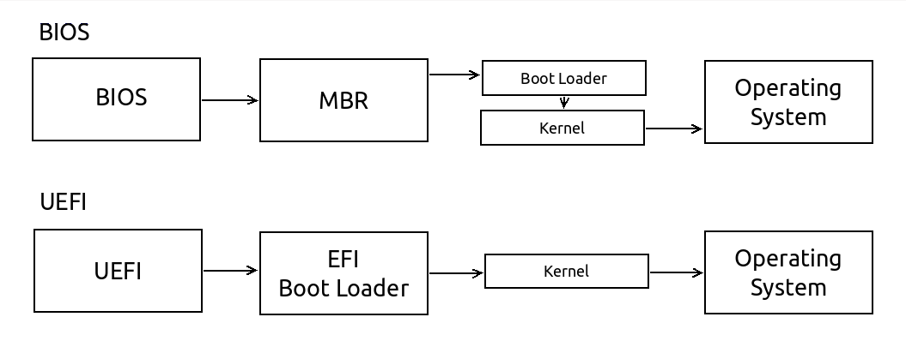
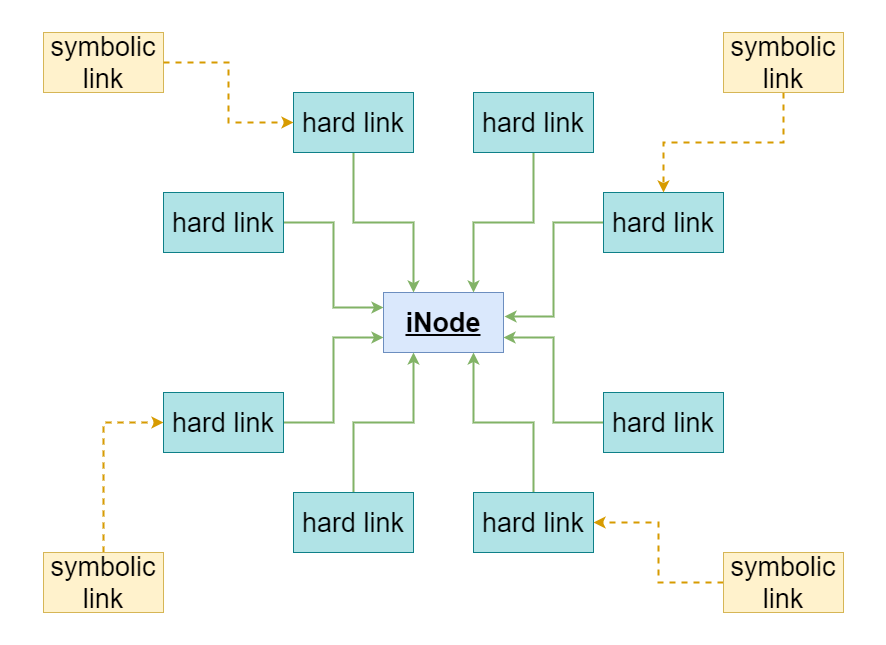

# Linux Essentials

## Introduction
### What is it?
> Linux is the best-known and most-used open source operating system. As an operating system, Linux is software that sits underneath all of the other software on a computer, receiving requests from those programs and relaying these requests to the computer’s hardware. -> [linux.com | what is linux ](https://www.linux.com/what-is-linux/)

### How is it used?
* The OS is chosen based on the business requirements and workloads (usually ubuntu or centos) but this can become a hard task as out in the world there is a huge amount of linux distribution, theoreticaly, as it's an open source project, anyone can create his distro.

    

* After one or more OS distributions are choosen and installed it's time to boot the system and start working. There are 2 main motherboard firmware types: the older one `BIOS` and the newer one `UEFI`, that in the end will do the same thing, it will start the OS. -> [superuser.com | boot differenece between bios and uefi](https://superuser.com/questions/496026/what-is-the-difference-in-boot-with-bios-and-boot-with-uefi)

    

* Working on a server usually refers to interacting with one or more of these areas, and the tasks can vary in difficulty from something as simply as copying a file to writing and deployng distributed workloads. 
    * storage
        ```
        databases, filestorages, backups
        ```
    * compute
        ```
        applications, services, agents
        ```
    * communication
        ```
        email, vpn, jump hosts, load balancers
        ```
___
## Working with a Linux Server as a DevOps engineer
### 1. Connect and check the server status
* As an engineer, you'll connect to a Linux server using ssh. For that you'll need the IP and the port (by default, the port number is 22), an active user and its password or ssh key pair. As plain passwords are easyly compromisable, it is a good practice to disable password login and use a ssh key pair.
    ```
    ssh -i ~/.ssh/private_key user@host:port
    ```
* To generate a new ssh key pair one can use this oneliner:
    ```
    KEY_NAME=example; ssh-keygen -t rsa -q -P "" -f $KEY_NAME
    ```
* Before starting to work on your tasks, you should always run some minimal checks that will give a you a good grasp of what is happening on the server.
    * `cross check name and/or private/public IPs with the infrastructure documentation to be sure you'll work on the desired server and not mistakenly on a sensible production server!`
    * users working on the same machine
        ```
        who
        echo "Hi Folks! I'm ${USER}." | wall
        ```
    * available disk space (storage)
        ```
        df -h
        ```
    * server load (cpu / ram)
        ```
        htop
        ```
    * active listened ports (communication)
        ```
        netstat -nltp
        ```
    * linux distribution (package manager)
        ```
        lsb_release -a
        ```
___
### 2. Work
> In Linux, everything is a file. any service or script or command is a process that is backed by a set of files. -> [linux.com | filsystem explained](https://www.linux.com/training-tutorials/linux-filesystem-explained/)

* users and permissions
    * for a new user, create the linux user and add his public key to his ssh directory
        ```
        NEW_USER=tom
        sudo useradd -m ${NEW_USER}
        nano /home/${NEW_USER}/.ssh/authorized_keys     # ssh-rsa AAAAB3NzaC...
        sudo visudo                                     # tom ALL=(ALL:ALL) NOPASSWD:ALL
        cat /etc/sudoers | grep tom

        sudo chown tom:tom file.out
        sudo usermod -aG docker tom
        ```
    * permissions -> [linux.com | file permissions](https://www.linux.com/training-tutorials/understanding-linux-file-permissions/)
        ```
        4 - r - read
        2 - w - write
        1 - x - execute
        ```
        ```
        owner/group/world
        7     5     5

        sudo chmod 777 file.out 
        sudo chmod 755 file.out 
        sudo chmod 644 file.out
        sudo chmod +x  file.out 
        sudo chmod 400 file.pem
        ```
        ```
        ls -al
        ```
    * terminal communication
        ```
        who
        wall
        write tom
        ```
* The filesystem
    * Everything on your Linux system is located under the `/ `directory, known as the root directory.

        ```
        .
        ├── bin     # binaries
        ├── boot    # boot files
        ├── dev     # device files
        ├── etc     # configuration files
        ├── home    # user personal data
        ├── lib     # shared libraries
        ├── media   # mount points for removable media
        ├── mnt     # mount directory
        ├── opt     # optional software
        ├── proc    # process and kernel files
        ├── root    # root's home directory
        ├── sbin    # system binaries
        ├── srv     # srvice data
        ├── tmp     # temporary files
        ├── usr     # user binaries 
        └── var     # variable data files
        ```
        ```
        cd, ls, mkdir, tree, locate, find, ncdu, lsof
        ```
    * basic commands (copy, move, rename, remove)
        ```
        cp, mv, rm
        ```
    * text editors
        ```
        nano, vim
        ```
    * read files
        ```
        cat, less, tail
        ```
    * standard output `stdout` and standard error `stderr`
        ```
        echo "smt" > /dev/stdout
        echo "smt" > /dev/stderr
        ```
    * text streaming processing
        ```
        # commands
        grep, wc, sed, awk, xargs

        # redirects
        >, >>, <, <<, |, &>, 2>&1

        # examples
        echo -e "error ErRoR\n2342\nasdaasd 34 565 \n ERROR 345 34 \n ops 11 22 33\n error \n smts1234" > file.out

        cat file.out | grep -in error
        sed -i 's/ops/devops/g' file.out
        cat file.out | awk '{ print $3 }'
        ls -al | awk '{ print $1,$4}'
        cat > file.out
        echo "rewrite the file" > file.out
        echo "some new line appended" >> file.out
        ls -al | tee -a file.out
        cat file.ou3 2> err.file.out 1> file.out
        cat file.ou3 >> file.out 2>&1
        cat file.ou3 &>> file.out
        ```

    * sensible configuration changes

        ```
        cp file.config work_file.config
        nano work_file.config                               # edit configuration
        less work_file.config                               # check changes
        PATCH="patchfile_$(date +'%Y_%M_%d')"
        diff -Naur file.config work_file.config > ${PATCH}
        less ${PATCH}                                        # check changes
        patch -b file.config ${PATCH} 
        rm work_file.config
        ```
    * Links
        * In your Linux file system, a link is a connection between a file name and the actual data on the disk. There are two main types of links that can be created: "hard" links, and "soft" or symbolic links. -> [linux.com | links](https://www.linux.com/topic/desktop/understanding-linux-links/)
        
        ```
        touch random.file
        stat random.file
        stat -f random.file

        ln random.file hard_random.file
        ln -s random.file soft_random.file
        tail -n+1 *random.file

        for file in *random.file; do echo -e "======\n $file \n=====" && stat $file; done

        echo "observe the differences!" > random.file
        tail -n+1 *random.file

        echo "soft string" >> soft_random.file
        tail -n+1 *random.file

        echo "hard string" >> hard_random.file
        tail -n+1 *random.file

        rm random.file
        ls -al | grep random.file
        tail -n+1 *random.file

        ```
* package management
    *  A package manager or package-management system is a collection of software tools that automates the process of installing, upgrading, configuring, and removing computer programs for a computer in a consistent manner. -> [opensource.com | apt ](https://opensource.com/article/21/6/apt-linux)  
        ```
        sudo apt update                             # update package lists
        sudo apt upgrade                            # upgrade packeages
        dpkg -l python* | grep language
        sudo apt install ncdu -y
        sudo apt remove ncdu -y
        sudo apt autoremove                         # removes not needed packages
        sudo apt autoclean                          # remove old packages
        ```

    * most commands have docummentation pages available in the terminal
        ```
        man grep
        man tree
        man python
        ```

    * binary's instalation directory can be checked with:
        ```
        which python
        which java
        which netstat

        type -a python3
        readlink -f /usr/bin/python3
        ```

* scripting
    * a sample bash script can be found unde ./example/
    * to execute the script:
        ```
        cd ./example
        bash main.sh
        ```
    * multiple jobs can be ran in parallel aka in background
        ```
        sleep 100 && echo 'done' &
        jobs
        fg 1
        Ctrl+z       # (suspend)
        bg 1
        ```
* running scripts/apps/services
    * systemd -> [systemd.io](https://systemd.io/) --> [linode.com | systemd](https://www.linode.com/docs/guides/what-is-systemd/)
        ```
        /etc/systemd/system/
        /run/systemd/system/
        /usr/lib/systemd/user/ 
        ```
    * cronjob -> [ostechnix.com | cron jobs](https://ostechnix.com/a-beginners-guide-to-cron-jobs/)
        ```
        ./etc/cron.hourly
        ./etc/cron.d
        ./etc/cron.weekly
        ./etc/cron.monthly
        ./etc/cron.daily
        ```
        ```
        crontab -l
        crontab -e
        sudo crontab -u tom -l

        cat /etc/passwd | awk 'BEGIN { FS = ":"} ;{ print $1}' | xargs -I % sudo crontab -u % -l
        ```
___
### 3. Debug
* Configuration changes
    * processes
        ```
        ps aux | grep [name]
        tail -f /proc/{PID}/fd/1
        tail -f /proc/{PID}/fd/2

        strace -p{PID} -s9999 -e write
        ```
    * services
        ```
        systemctl --failed
        systemctl status [SERVICE_NAME].service
        journalctl -fu [SERVICE_NAME].service
        ```
    * logs
        ```
        tail -f /var/log/[SERVICE_NAME]/[SERVICE_NAME].log
        ```
* Server out of resources
    * disk
        ```
        df -h
        ncdu /var/log
        ncdu /home
        lsof | grep deleted
        du /work -aBM 2>/dev/null | sort -nr | head -n 50 | more
        find /work -size +10M -ls
        ```
    * cpu/mem
        ```
        free -h
        htop
        top
        atop
        ```
* Network issues
    ```
    nc -l [PORT_NUMBER]                     # listen port
    python3 http.server [PORT_NUMBER]       # simple http server
    ```
    ```
    ifconfig                                # list network interfaces
    ip addr                                 # list network interfaces
    curl ifconfig.io                        # get public ip
    ```
    ```
    curl localhost:[SERVICE_PORT_NUMBER]
    curl [PRIVATE_IP]:[SERVICE_PORT_NUMBER]
    curl [PUBLIC_IP]:[SERVICE_PORT_NUMBER]

    telnet [PRIVATE_IP] [SERVICE_PORT_NUMBER]
    telnet [PUBLIC_IP] [SERVICE_PORT_NUMBER]
    ```
    ```
    route -n
    ip route
    netstat -rn

    iptables -L
    ```
    ```
    netstat -nltp                           # check listened ports

    dig unix.stackexchange.com              # check where is the domain pointing to
    ```

___
## Practice
> Don't asume your work will last indefinitely, accidents may happen, server may fail | `Always back up your data!`
> Commit the scripts on your personal repositories.

1. Create a new rsa key pair. `SSH` into the practice server using the credentials below and create your own user to connect and work with.
    ```
    HOST: 20.74.32.95
    USER: rsod
    PASS: H71qRZPQgCqQ692a
    ```
2. Familiarise yourself with each command, checking it in `man` and running it with different flags and parameters
3. Create a script that will go through all the files in `/work/files/wiki/` and count the occurance of `engineer`. The output needs to have both the number of occurances and the time the script needed to find the solution.
4. Write a script that will start a small web server listening an unused port between `8000-9990` that will show new `top` command output every 10 seconds.
---
---
